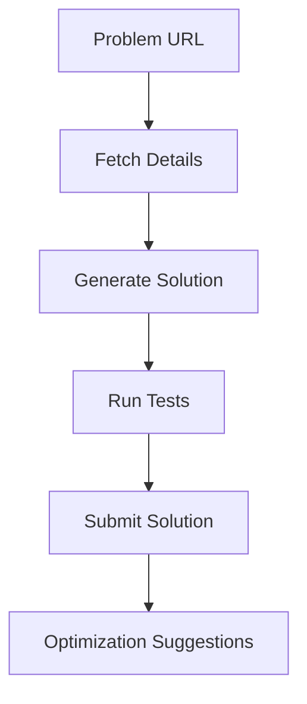

# LeetCode Automation Agent 🤖


[](https://opensource.org/licenses/MIT)

An AI-powered agent that automatically solves LeetCode problems by:
1. Scraping problem details
2. Generating solutions using DeepSeek AI
3. Testing and submitting solutions via browser automation
4. Providing optimization suggestions

---

## Features ✨

- **Smart Problem Analysis**: Extracts title, description, and difficulty
- **AI Solution Generation**: Uses DeepSeek's coder model for high-quality solutions
- **Automated Testing**: Runs test cases directly on LeetCode
- **Performance Metrics**: Captures runtime and memory statistics
- **Jupyter Support**: Ready-to-use in notebooks

---

## Installation 🛠️

```bash
git clone https://github.com/your-username/leetcode-agent.git
cd leetcode-agent
pip install -r requirements.txt
```

---

## Usage 🚀

```python
from leetcode_agent_cursor import quick_setup
solver = quick_setup(
    username="your_leetcode_username",
    password="your_leetcode_password",
    deepseek_api_key="your_api_key",
    headless=False  # Set to True for production
)

# Solve a problem
result = solver.solve_problem("https://leetcode.com/problems/two-sum/")
```

---

## Architechture


